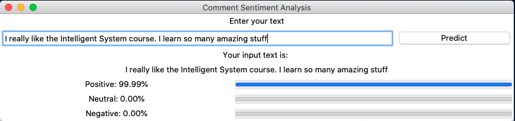

# IS_demo_app

Intelligence System Demo Application built with tkinter

## How to run it the right and simple way

Highly recommend that you have install virtualenv in your python environment. If you don't want to do it, it is fine anyway.

### Firstly install neccessary python package

```bash
pip install requirements.txt
```

### Run the user interface

```bash
python ui.py
```

### Interaction

Type some sentence you want to predict its sentiment and hit predict button. Wait for the answer and that's it. 🤗🚀🚂


